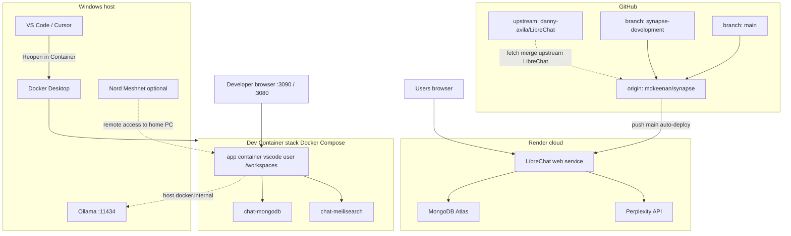
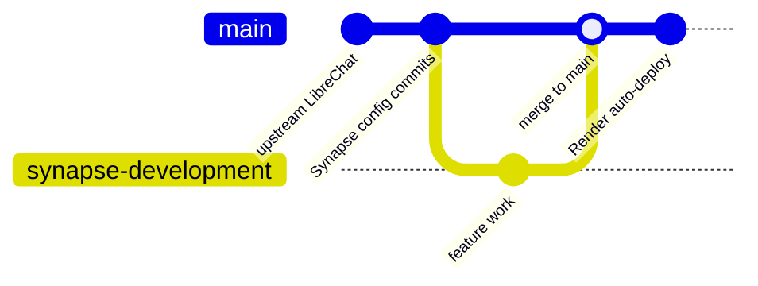
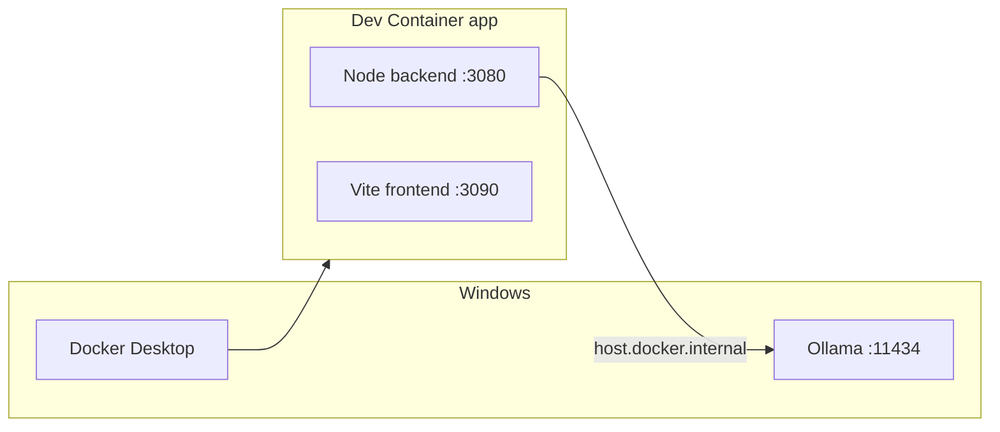
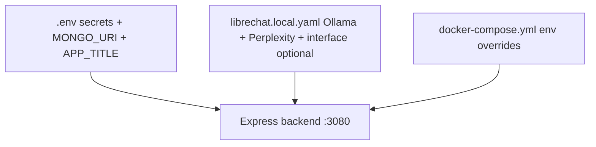
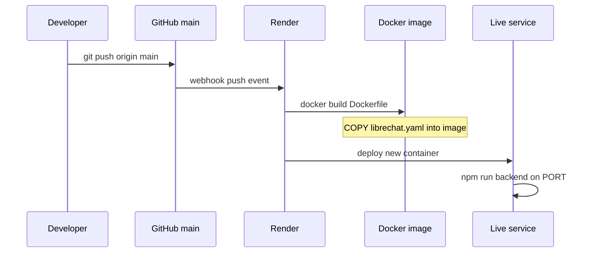
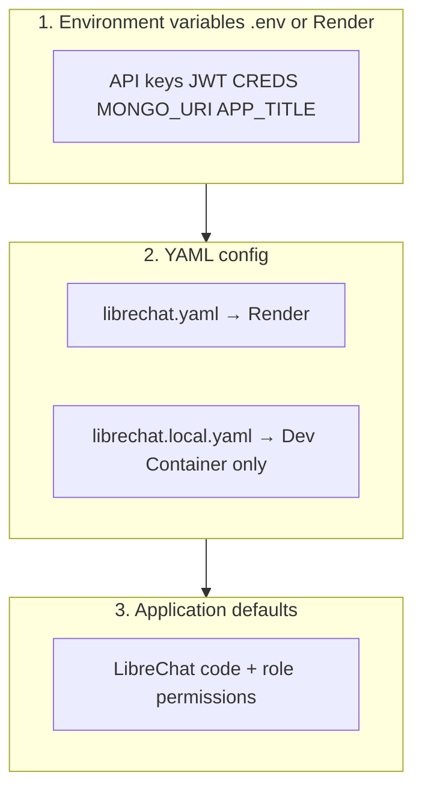
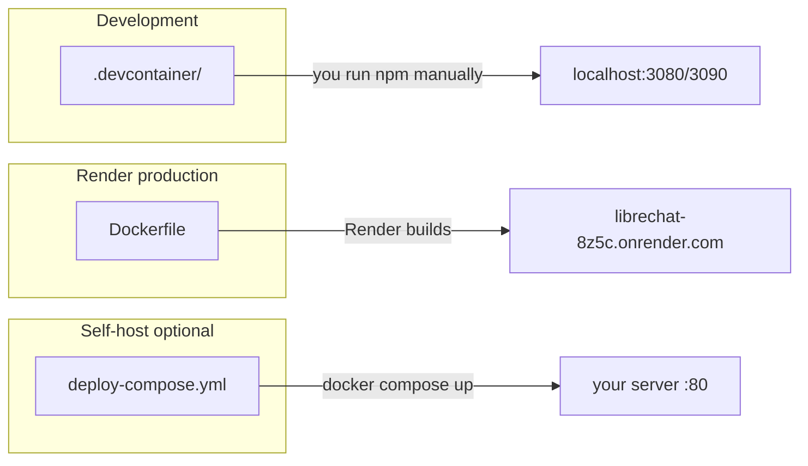
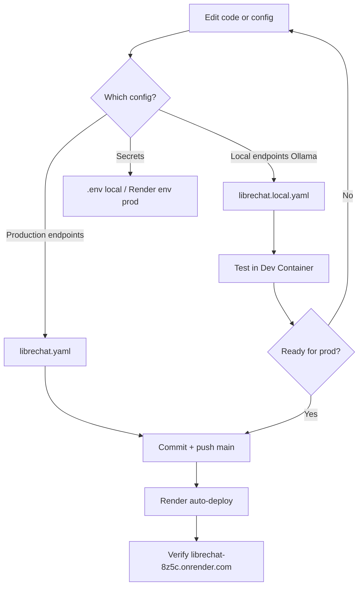

# Synapse Environment Architecture

> **Purpose:** A single reference for how local development, production, Git, Docker, Windows, and Render fit together — and what is intentionally kept separate.  
> **Last updated:** 2026-06-22  
> **Repository:** [github.com/mdkeenan/synapse](https://github.com/mdkeenan/synapse) (LibreChat v0.8.6 fork)

---

## At a glance

Synapse is one codebase with **three runtime contexts**:

| Context | Where it runs | Who uses it | Database | Config files |
|---------|---------------|-------------|----------|--------------|
| **Local dev** | Dev Container (Linux) on Windows via Docker Desktop | You, while coding | MongoDB in Docker (named volume) | `.env` + `librechat.local.yaml` |
| **Production** | Render web service (Linux container) | You + remote users | MongoDB Atlas (`MONGO_URI` on Render) | Render env vars + `librechat.yaml` baked into image |
| **Windows host** | Native Windows processes | Ollama, Docker Desktop, optional tools | Not used by Synapse directly | `OLLAMA_HOST`, etc. |

Nothing automatically syncs data or config between local and production. **Git** is the bridge for code and tracked config; **secrets** stay in `.env` (local) or Render env vars (prod).

---

## System diagram (everything together)



---

## Git and GitHub

### Repositories

| Remote | URL | Role |
|--------|-----|------|
| **origin** | `https://github.com/mdkeenan/synapse.git` | Your fork — **push and deploy from here** |
| **upstream** | `https://github.com/danny-avila/LibreChat.git` | Canonical LibreChat — **fetch only** for updates |

Synapse is a fork of LibreChat. Most of the tree is upstream code; Synapse-specific differences are concentrated in deployment config (`librechat.yaml`), branding assets, and docs.

### Branches

| Branch | Typical use | Deploys to Render? |
|--------|-------------|-------------------|
| **`main`** | Integration / production | **Yes** — Render watches `main` |
| **`synapse-development`** | Optional working branch | **No** — unless you change Render’s branch setting |

**Rule of thumb:** merge into `main` and push when you want production to update.



### What is committed vs local-only

| Path | In git? | Notes |
|------|---------|-------|
| Application source (`api/`, `client/`, `packages/`) | Yes | Shared by all environments |
| `librechat.yaml` | Yes (tracked despite `.gitignore` entry) | **Production** endpoint + interface config; copied into Docker image |
| `librechat.local.yaml` | **No** (gitignored) | **Local-only** Ollama + extra endpoints |
| `librechat.local.example.yaml` | Yes | Template to copy for local config |
| `.env` | **No** (gitignored) | Secrets and machine-specific settings |
| `.env.example` | Yes | Documentation template |
| `docs/` | Yes | Not included in production Docker image (see `.dockerignore`) |
| `.devcontainer/` | Yes | Dev Container definition only |
| Mongo / Meili data | **No** | Docker volumes on your machine |

See [UPSTREAM_MAINTENANCE.md](./UPSTREAM_MAINTENANCE.md) for merge strategy with upstream LibreChat.

---

## Windows host layer

Windows is the **physical machine**. Synapse does not run as a native Windows Node app in the recommended workflow — it runs **inside Linux containers**.

### What runs on Windows directly

| Component | Purpose |
|-----------|---------|
| **Docker Desktop** | Runs Dev Container + MongoDB + Meilisearch |
| **VS Code / Cursor** | Editor; attaches to Dev Container |
| **Ollama** | Local LLM server on port `11434` |
| **Nord Meshnet** (optional) | Remote access to home network (e.g. `michaelkeenan.com-everest.nord`) |

### Ollama and the Dev Container

Ollama listens on the **Windows host**. The Dev Container reaches it via:

```text
http://host.docker.internal:11434/v1/
```

Configured in `librechat.local.yaml` (not in production `librechat.yaml`).  
Set `OLLAMA_HOST=0.0.0.0:11434` on Windows so the container can connect.

### What not to do on Windows

- Do **not** run `npm install` on the host and expect it to work in the container — native bindings differ (Linux vs Windows).
- Install dependencies **inside** the Dev Container after `Reopen in Container`.



---

## Dev environment (Dev Container)

Detailed day-to-day steps: [DEV_CONTAINER.md](./DEV_CONTAINER.md).

### Docker Compose services

Defined in `.devcontainer/docker-compose.yml`:

| Service | Container name | Role |
|---------|----------------|------|
| **app** | `synapse_devcontainer-app-1` | Dev shell; repo mounted at `/workspaces` |
| **mongodb** | `chat-mongodb` | Local MongoDB (`mongo:8.0.20`) |
| **meilisearch** | `chat-meilisearch` | Local search index |

### How the app container is configured

| Setting | Value | Effect |
|---------|-------|--------|
| `CONFIG_PATH` | `/workspaces/librechat.local.yaml` | Uses **local** YAML (Ollama + Perplexity) |
| `MONGO_URI` | `mongodb://mongodb:27017/LibreChat` | Docker network hostname `mongodb` |
| `MEILI_HOST` | `http://meilisearch:7700` | In-compose Meilisearch |
| `extra_hosts` | `host.docker.internal:host-gateway` | Reach Windows Ollama |

`devcontainer.json` forwards ports **3080** (backend) and **3090** (Vite HMR).

### Local dev startup

```text
Terminal 1:  npm run backend:dev     →  http://localhost:3080
Terminal 2:  npm run frontend:dev     →  http://localhost:3090  (recommended for UI work)
```

### Data persistence (local only)

| Data | Storage |
|------|---------|
| MongoDB | Docker named volume `devcontainer_mongodb_data` |
| Meilisearch | Bind mount `.devcontainer/meili_data_v1.5/` |
| Uploads / logs | Under repo paths when used locally |

Deleting volumes **wipes local users and conversations** — run `npm run create-user` again after a reset.

### Local config stack



---

## Production environment (Render)

### Service overview

| Item | Value |
|------|-------|
| **Dashboard name** | LibreChat |
| **URL** | https://librechat-8z5c.onrender.com |
| **Service ID** | `srv-d8n307btqb8s73cn9g80` |
| **Repo** | `mdkeenan/synapse` |
| **Branch** | `main` |
| **Build** | `Dockerfile` (root) — full image with frontend build |
| **Auto-deploy** | On push to `main` |

There is **no `render.yaml`** in the repo; the service is configured in the Render Dashboard.

### Production deploy flow



### What production uses instead of local services

| Concern | Local dev | Production (Render) |
|---------|-----------|---------------------|
| **MongoDB** | Container `chat-mongodb` | **MongoDB Atlas** via `MONGO_URI` env var |
| **Meilisearch** | In compose | Often unset on free tier |
| **LLM endpoints** | Ollama + Perplexity (`librechat.local.yaml`) | **Perplexity only** (`librechat.yaml`) |
| **Secrets** | `.env` file | Render **Environment** tab |
| **Filesystem** | Persistent local volumes | **Ephemeral** — uploads lost on redeploy unless external storage |
| **Config YAML** | `librechat.local.yaml` | `librechat.yaml` in git → baked into image |

### Production `librechat.yaml` (tracked)

Current production-oriented settings include:

- `interface.agents` and `interface.marketplace` enabled
- Perplexity custom endpoint (`PERPLEXITY_API_KEY` from Render env)

Ollama is **intentionally absent** from production config.

### `.dockerignore` and the image

The production build:

- **Includes** `librechat.yaml` (exception: `!librechat.yaml` in `.dockerignore`)
- **Excludes** `librechat.local.yaml`, `.env`, `docs/`, `node_modules`, `.git`

So production never sees your local-only files.

---

## Configuration separation (the most important concept)

Three layers stack on top of each other:



| File | Environment | Contains |
|------|-------------|----------|
| **`.env`** | Local only (gitignored) | Secrets, `MONGO_URI`, `APP_TITLE`, `CONFIG_PATH` override if needed |
| **`librechat.yaml`** | Production (in git + Docker image) | Perplexity, agents/marketplace interface, prod-safe endpoints |
| **`librechat.local.yaml`** | Local only (gitignored) | Ollama, extra endpoints, local interface tweaks |
| **Render env vars** | Production | `MONGO_URI`, `PERPLEXITY_API_KEY`, `APP_TITLE`, `JWT_*`, etc. |

**`CONFIG_PATH`** tells the backend which YAML file to load:

- Dev Container sets it to `librechat.local.yaml` in compose.
- Render typically uses default `./librechat.yaml` (bundled in the image).

---

## Docker: three different uses

Do not confuse these — they serve different purposes:

| Docker setup | File(s) | Purpose |
|--------------|---------|---------|
| **Dev Container** | `.devcontainer/docker-compose.yml` | Daily development with hot reload |
| **Production image** | `Dockerfile` | What Render builds and runs |
| **Full stack compose** | `deploy-compose.yml` | Optional self-hosted prod-like stack (nginx + api + mongo + rag); **not** used by Render today |



---

## Remote access patterns

| Goal | Approach |
|------|----------|
| Use Synapse from anywhere (no home PC) | https://librechat-8z5c.onrender.com |
| Dev Synapse while away from home | Nord Meshnet to home PC + forwarded ports 3080/3090 |
| Hit Ollama on home PC remotely | Meshnet hostname + port 11434 (Ollama on Windows) |
| Share prod with others | Render URL + user accounts on Atlas DB |

Local dev and production are **separate user databases** — accounts created locally do not exist in production unless you create them there too.

---

## Separation cheat sheet

Use this when deciding where to make a change:

| I want to… | Change here | Affects |
|------------|-------------|---------|
| Add Ollama model locally | `librechat.local.yaml` | Dev only |
| Add production LLM endpoint | `librechat.yaml` → commit → push `main` | Render |
| Store API key | `.env` (local) or Render env (prod) | That environment only |
| Enable agents/marketplace in prod | `librechat.yaml` `interface:` block | Render after deploy |
| Try agents locally | `librechat.local.yaml` or copy interface block from prod yaml | Dev only |
| Update application code | `api/`, `client/`, `packages/` → commit → push | Both after deploy / local restart |
| Reset local database | Remove Docker Mongo volume / data dir | Dev only |
| Sync with LibreChat upstream | `git fetch upstream` + merge/rebase | Codebase; test locally before pushing `main` |
| Change prod app title | `APP_TITLE` on Render (+ optional `.env` locally) | Branding |

---

## End-to-end developer workflow



1. **Develop** inside Dev Container (`backend:dev` + `frontend:dev`).
2. **Configure locally** with `.env` + `librechat.local.yaml` — never commit secrets.
3. **Promote config to prod** by editing tracked `librechat.yaml` and merging to `main`.
4. **Promote code** the same way — push `main`, wait for Render deploy.
5. **Pull upstream LibreChat** periodically via `upstream` remote (see [UPSTREAM_MAINTENANCE.md](./UPSTREAM_MAINTENANCE.md)).

---

## Related documents

| Document | Focus |
|----------|-------|
| [DEV_CONTAINER.md](./DEV_CONTAINER.md) | Setup, daily commands, troubleshooting |
| [UPSTREAM_MAINTENANCE.md](./UPSTREAM_MAINTENANCE.md) | Git remotes, branches, upstream merges |
| [SYNAPSE_CUSTOMIZATION_MAP.md](./SYNAPSE_CUSTOMIZATION_MAP.md) | Branding and UI customization locations |
| [SYNAPSE_REPOSITORY_ANALYSIS.md](./SYNAPSE_REPOSITORY_ANALYSIS.md) | Codebase structure and architecture |
| [SYNAPSE_GAP_ANALYSIS.md](./SYNAPSE_GAP_ANALYSIS.md) | Product/roadmap gaps |

---

## Quick reference URLs and ports

| Resource | URL / port |
|----------|------------|
| Production Synapse | https://librechat-8z5c.onrender.com |
| Local backend | http://localhost:3080 |
| Local frontend (HMR) | http://localhost:3090 |
| Local MongoDB (from container) | `mongodb://mongodb:27017/LibreChat` |
| Local Ollama (from container) | `http://host.docker.internal:11434` |
| Ollama (from Windows) | http://localhost:11434 |
| GitHub repo | https://github.com/mdkeenan/synapse |
| Render service dashboard | https://dashboard.render.com/web/srv-d8n307btqb8s73cn9g80 |
