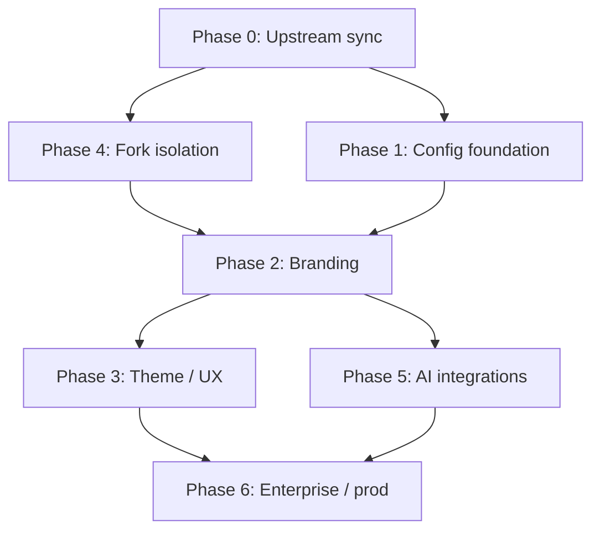

# Synapse Gap Analysis

> **Generated:** 2026-06-14  
> **Repository:** `mdkeenan/synapse` (LibreChat v0.8.6 fork)  
> **Comparison baseline:** Synapse product roadmap (derived from [SYNAPSE_REPOSITORY_ANALYSIS.md](./SYNAPSE_REPOSITORY_ANALYSIS.md) customization tiers, [SYNAPSE_CUSTOMIZATION_MAP.md](./SYNAPSE_CUSTOMIZATION_MAP.md) rebrand sequence, and [UPSTREAM_MAINTENANCE.md](./UPSTREAM_MAINTENANCE.md) isolation layers)

---

## Executive Summary

The repository is a **near-pristine LibreChat fork**. Synapse-specific work is limited to **five commits** that only touch `librechat.yaml` (Perplexity endpoint + version bump). No code, assets, or environment files reference “Synapse.”

**Inherited from upstream (already available, not Synapse-specific):** full chat UI, multi-provider LLM routing, Passport auth (local/JWT/OAuth/OpenID/SAML/LDAP), agents, MCP runtime, memory subsystem, RAG integration hooks, PWA build pipeline, Docker Compose, and Helm charts.

**Primary gaps:** branding/product identity, fork isolation for upstream merges, deployment hardening, and Synapse-specific configuration beyond a single custom endpoint.

| Phase | Status | Effort to complete |
|-------|--------|-------------------|
| 0 — Platform baseline | Mostly done (upstream) | Low (sync only) |
| 1 — Fork & config foundation | Partial | Small (1–2 days) |
| 2 — Branding & product identity | Missing | Medium (3–5 days) |
| 3 — Theme & UX polish | Missing | Medium (3–5 days) |
| 4 — Fork isolation & ops hygiene | Missing | Medium (2–4 days) |
| 5 — AI capabilities & integrations | Partial | Medium–Large (1–2 weeks) |
| 6 — Enterprise & production deploy | Partial (upstream infra) | Large (2–4 weeks) |

**Recommended order:** Phase 0 sync → Phase 4 (early) → Phase 1 → Phase 2 → Phase 3 → Phase 5 → Phase 6.

---

## Roadmap Source

No standalone `SYNAPSE_ROADMAP.md` exists in this repository. Phases below are the **canonical Synapse delivery sequence** implied by project documentation:

1. **Tier 1–4 customization priorities** — [SYNAPSE_REPOSITORY_ANALYSIS.md §19](./SYNAPSE_REPOSITORY_ANALYSIS.md)
2. **Seven-step rebrand sequence** — [SYNAPSE_CUSTOMIZATION_MAP.md](./SYNAPSE_CUSTOMIZATION_MAP.md)
3. **Three-layer fork isolation model** — [UPSTREAM_MAINTENANCE.md](./UPSTREAM_MAINTENANCE.md)

If your product roadmap differs (e.g. Notion spec, issue milestones), replace the phase definitions here and re-run the status columns.

---

## Phase 0 — Platform Baseline (LibreChat Core)

**Goal:** Runnable AI workspace with chat, auth, search, agents, MCP, memory, and optional RAG — inherited from upstream without Synapse customization.

### Already implemented

| Item | Evidence |
|------|----------|
| Monorepo build (Turborepo) | Root `package.json`, `turbo.json` |
| React SPA + Express API | `client/`, `api/server/index.js` |
| MongoDB persistence | `api/db/connect.js`, `packages/data-schemas/` |
| Meilisearch conversation search | `docker-compose.yml`, env vars in `.env.example` |
| Passport auth strategies | `api/strategies/` (local, JWT, LDAP, OAuth, OpenID, SAML) |
| Agents runtime integration | `packages/api/src/agents/`, `@librechat/agents` |
| MCP server manager & OAuth | `packages/api/src/mcp/` |
| Memory schema & API | `packages/data-schemas/src/schema/memory.ts`, routes |
| RAG file pipeline & compose services | `docker-compose.yml` → `rag_api`, `vectordb`; `packages/api/src/files/rag.ts` |
| PWA build plugin (unbranded) | `client/vite.config.ts` → `VitePWA` |
| Docker & Helm deployment templates | `docker-compose.yml`, `deploy-compose.yml`, `helm/` |
| Playwright e2e & Jest tests | `e2e/`, workspace `__tests__/` |

### Partially implemented

| Item | Gap |
|------|-----|
| Upstream currency | **19 commits behind** `danny-avila/LibreChat` `main` (as of 2026-06-14); no `upstream` remote configured |
| RAG stack | Compose services exist; not enabled in minimal `librechat.yaml`; requires env + pgvector deployment |
| PWA icon assets | Referenced in `index.html` / manifest but PNG favicons **not committed** under `client/public/assets/` |

### Missing

| Item | Notes |
|------|-------|
| Synapse-specific platform code | Zero matches for `Synapse` / `synapse` in source |
| Production cloud blueprint | No `render.yaml` or Synapse CI pipeline |

### Estimated effort

| To… | Effort |
|-----|--------|
| Sync to upstream `main` | **0.5–1 day** (merge + test; only `librechat.yaml` conflict expected today) |
| Enable RAG in a target environment | **1–2 days** (env, compose, smoke test) |
| Add missing PWA PNG assets (generic, pre-rebrand) | **0.5 day** |

### Recommended implementation order

**1** — Add `upstream` remote and merge before any Synapse branding (reduces rework).

---

## Phase 1 — Fork & Configuration Foundation

**Goal:** Synapse deployment identity in config layers (env + YAML) without forking application code.

### Already implemented

| Item | Evidence |
|------|----------|
| Git fork on GitHub | `origin` → `https://github.com/mdkeenan/synapse.git` |
| Custom endpoint: Perplexity | `librechat.yaml` → `endpoints.custom` |
| YAML version tracking | `version: 1.3.12` in `librechat.yaml` |
| Docker volume mount for YAML | `deploy-compose.yml` binds `./librechat.yaml` |
| Skill directory mount point | `deploy-compose.yml` → `./skill:/app/skill` |
| Example env template | `.env.example` (still defaults to `APP_TITLE=LibreChat`) |

### Partially implemented

| Item | Gap |
|------|-----|
| `librechat.yaml` scope | Only Perplexity + cache; no `interface`, `memory`, `mcpServers`, or `modelSpecs` |
| Config git hygiene | File is in `.gitignore` but **still tracked** — causes merge friction |
| Deployment skills | `skill/` exists with README only; **no `SKILL.md` skills** |

### Missing

| Item | Notes |
|------|-------|
| Synapse `.env` / `.env.synapse.example` | `APP_TITLE`, `CUSTOM_FOOTER`, `HELP_AND_FAQ_URL`, provider keys |
| `interface.customWelcome`, terms, privacy | Per [SYNAPSE_CUSTOMIZATION_MAP.md](./SYNAPSE_CUSTOMIZATION_MAP.md) |
| Documented model/endpoints policy | Which providers ship in Synapse vs. user-configured |
| `synapse/librechat.synapse.yaml` template | Recommended in [UPSTREAM_MAINTENANCE.md](./UPSTREAM_MAINTENANCE.md) |

### Estimated effort

| To… | Effort |
|-----|--------|
| Complete Synapse YAML + env template | **1 day** |
| Untrack `librechat.yaml`, add example template | **0.5 day** |
| Author first deployment skill | **0.5–1 day** per skill |

### Recommended implementation order

**2** — After upstream sync; before code branding so runtime titles can come from env immediately.

---

## Phase 2 — Branding & Product Identity

**Goal:** User-visible product is “Synapse,” not LibreChat.

### Already implemented

| Item | Evidence |
|------|----------|
| Runtime title hook | `Startup.tsx` uses `startupConfig?.appTitle` (works once `APP_TITLE` set) |
| Config API for title/footer | `api/server/routes/config.js` serves `appTitle`, `customFooter` |
| Email templates use `{{appName}}` | `api/server/utils/emails/*.handlebars` — driven by env |
| Logo asset slot | `client/public/assets/logo.svg` (still LibreChat artwork) |

### Partially implemented

| Item | Gap |
|------|-----|
| Product name | Defaults everywhere remain **LibreChat** (`index.html`, PWA manifest, `.env.example`, API fallbacks) |
| PWA manifest | `vite.config.ts`: `name` / `short_name` = `LibreChat`; `theme_color` = `#009688` |
| Browser shell | `index.html` title, description, theme-color = LibreChat copy |
| Legal / welcome copy | Not set in `librechat.yaml` |
| i18n | `com_agents_mcp_trust_subtext` and others still say “LibreChat” in `en` and all locales |

### Missing

| Item | Notes |
|------|-------|
| Synapse logo SVG | Replace `client/public/assets/logo.svg` |
| Full PWA icon set | `favicon-*.png`, `apple-touch-icon`, `icon-192x192.png`, `maskable-icon.png` |
| Hardcoded fallback edits | `Chat/Footer.tsx`, `Agents/Marketplace.tsx`, `About.tsx`, OpenRouter headers, MCP OAuth client name — see customization map |
| `EMAIL_FROM` / `EMAIL_FROM_NAME` for Synapse domain | Env only |
| Package metadata (optional) | Root `package.json` homepage still LibreChat |

### Estimated effort

| To… | Effort |
|-----|--------|
| Env + YAML branding (no code) | **0.5–1 day** |
| Asset generation (logo + icon set) | **1–2 days** (design-dependent) |
| Code fallbacks + en i18n | **1 day** |
| All locale updates | **0.5 day** (or defer to automated i18n pipeline) |

### Recommended implementation order

**3** — Follow [SYNAPSE_CUSTOMIZATION_MAP.md § Recommended Rebrand Sequence](./SYNAPSE_CUSTOMIZATION_MAP.md): env → assets → `index.html`/manifest → YAML → i18n → fallbacks → verify.

---

## Phase 3 — Theme & UX Polish

**Goal:** Distinct Synapse look-and-feel on login, navigation, mobile, and settings.

### Already implemented

| Item | Evidence |
|------|----------|
| CSS variable theming | `client/src/style.css`, dark/light/system via Recoil |
| Tailwind design tokens | `client/tailwind.config.cjs` |
| Responsive nav + mobile sidebar | `client/src/components/Nav/`, `MobileNav` patterns |
| Auth layout shell | `client/src/components/Auth/AuthLayout.tsx` |
| Settings tab framework | `client/src/components/Nav/SettingsTabs/` |
| Banner API | `api/server/routes/banner.js`, `config/update-banner.js` |

### Partially implemented

| Item | Gap |
|------|-----|
| Brand colors | Default LibreChat palette (`#009688` accent in manifest; `#171717` theme-color in HTML) |
| Login experience | Functional but LibreChat logo and copy |
| Mobile PWA install UX | Infrastructure present; icons/branding missing (Phase 2 dependency) |
| About / diagnostics | Still labels output `LibreChat version:` |

### Missing

| Item | Notes |
|------|-------|
| Synapse color system | Update `style.css`, Tailwind config, manifest `theme_color`, email button colors |
| Auth layout customization | Optional layout/copy changes in `AuthLayout.tsx` |
| Navigation chrome tweaks | Synapse-specific nav labels, help links |
| Settings “About Synapse” copy | i18n + About tab content |
| Synapse default model landing | `librechat.yaml` → `modelSpecs`, `interface` defaults |
| Optional `packages/synapse/` theme tokens | Recommended isolation pattern from upstream maintenance doc |

### Estimated effort

| To… | Effort |
|-----|--------|
| Color/token pass (CSS + manifest + emails) | **1–2 days** |
| Login + nav copy/layout | **1 day** |
| Mobile/PWA verification pass | **0.5–1 day** |
| Optional `packages/synapse/` theme package | **1–2 days** |

### Recommended implementation order

**4** — After Phase 2 assets exist; theme colors should reference final Synapse palette.

---

## Phase 4 — Fork Isolation & Operational Hygiene

**Goal:** Synapse diffs stay mergeable with upstream LibreChat indefinitely.

### Already implemented

| Item | Evidence |
|------|----------|
| Analysis documentation | `docs/SYNAPSE_*`, `UPSTREAM_MAINTENANCE.md`, `DEPENDENCY_INVENTORY.md` |
| `.gitignore` entry for `librechat.yaml` | Present (but overridden by tracked file) |
| Bind-mount config in Docker | Deployment-friendly pattern in compose files |

### Partially implemented

| Item | Gap |
|------|-----|
| Upstream remote | **Not configured** |
| Branch strategy | Single `main`; no `sync/upstream-*` branches |
| Config separation | All Synapse YAML changes live in tracked git history |
| Update script | `config/deployed-update.js` pulls **origin**, not upstream LibreChat |

### Missing

| Item | Notes |
|------|-------|
| `git remote add upstream https://github.com/danny-avila/LibreChat.git` | Documented but not done |
| `synapse/` directory for assets + example configs | Not created |
| `packages/synapse/` optional package | Not created |
| Single-commit discipline for fork changes | Only YAML commits so far; will matter once branding lands |
| CI: build + test on PR | No Synapse-specific workflow |
| Dependency upgrade cadence | Documented in inventory; no automation |

### Estimated effort

| To… | Effort |
|-----|--------|
| Upstream remote + first merge | **0.5–1 day** |
| Untrack YAML + `synapse/` template layout | **0.5 day** |
| Basic GitHub Actions (build + jest) | **1–2 days** |
| `packages/synapse/` scaffold | **1 day** |

### Recommended implementation order

**Early (parallel with Phase 1)** — Isolation before large branding commits prevents painful rebases. Complete upstream sync (Phase 0) first.

---

## Phase 5 — AI Capabilities & Integrations

**Goal:** Synapse-specific AI features: curated models, MCP tools, memory policy, knowledge bases, deployment skills.

### Already implemented (platform capability — upstream)

| Item | Evidence |
|------|----------|
| Multi-endpoint routing | OpenAI, Anthropic, Google, custom, agents, etc. |
| MCP tool registry & OAuth | `packages/api/src/mcp/` |
| Agent builder & marketplace UI | `client/src/components/Agents/` |
| Memory CRUD & agent hooks | `packages/api/src/memory/`, SidePanel UI |
| File upload + embedding pipeline | When RAG env configured |
| Agent file search tool | `api/app/clients/tools/util/fileSearch.js` |

### Partially implemented

| Item | Gap |
|------|-----|
| Custom endpoints | **Perplexity only** in `librechat.yaml` |
| MCP servers | None configured in YAML (examples in `librechat.example.yaml` only) |
| Memory | Platform enabled; **no Synapse `memory:` block** (limits, agent id, personalization) |
| RAG | Stack in compose; **not wired** in current minimal YAML/env for this fork |
| Deployment skills | Mount ready; **directory empty** |

### Missing

| Item | Notes |
|------|-------|
| Synapse MCP connectors | e.g. internal APIs, Obsidian, Slack — YAML + secrets |
| Curated `modelSpecs` / default agent | Product policy for landing experience |
| Memory governance | Token limits, allowed keys, dedicated memory agent |
| Synapse knowledge bases | RAG collections, embedding model choice, retention policy |
| Custom `@librechat/agents` hooks | Only if behavior exceeds YAML — prefer `packages/api` |
| Provider header branding | `packages/api/src/endpoints/openai/config.ts` still sends `LibreChat` |

### Estimated effort

| To… | Effort |
|-----|--------|
| YAML: endpoints + modelSpecs + 1–2 MCP servers | **2–3 days** |
| Memory + RAG tuning for one environment | **2–4 days** |
| First deployment skill (documented workflow) | **1–2 days** each |
| Custom MCP server (if building new) | **1–2 weeks** per integration |

### Recommended implementation order

**5** — After branding (users see “Synapse” while testing integrations). Start with YAML-only changes; add code in `packages/api` only when necessary.

---

## Phase 6 — Enterprise Auth & Production Deployment

**Goal:** Production-grade Synapse deployment with enterprise login, durable storage, monitoring, and cloud IaC.

### Already implemented (upstream)

| Item | Evidence |
|------|----------|
| OpenID Connect strategy | `api/strategies/openidStrategy.js` |
| SAML strategy | `api/strategies/samlStrategy.js` |
| LDAP strategy | `api/strategies/ldapStrategy.js` |
| S3 / Firebase / Azure file storage | `packages/api/src/files/`, `.env.example` |
| Rate limiting & ban middleware | `api/server/middleware/` |
| 2FA | `TwoFactorController.js` |
| OpenTelemetry & Langfuse hooks | Optional env in `.env.example` |
| Multi-stage Docker build | `Dockerfile.multi` |
| Helm charts | `helm/librechat/`, `helm/librechat-rag-api/` |

### Partially implemented

| Item | Gap |
|------|-----|
| Docker naming/branding | Containers still `LibreChat-*`; image `registry.librechat.ai/.../librechat-dev-api` |
| MongoDB database name | Default `LibreChat` in compose |
| Production compose | Uses upstream dev image tag; Synapse-specific image build commented out |
| Cloud deploy | No Render/Railway/Fly blueprint in repo |

### Missing

| Item | Notes |
|------|-------|
| Synapse production Dockerfile/image pipeline | Build and push `synapse-api` image |
| `render.yaml` (or equivalent) | Web service + MongoDB + optional Key Value + RAG |
| Enterprise IdP configuration | OpenID/SAML env for target tenant |
| Secrets management | Provider keys, MCP OAuth, DB URIs — not in git |
| Custom domain + TLS runbook | Synapse operator docs |
| Backup / DR for MongoDB + vector DB | Operational procedure |
| RUM / error monitoring config | `@librechat/client` RUM routes exist; not Synapse-configured |

### Estimated effort

| To… | Effort |
|-----|--------|
| Synapse Docker image + compose rename | **1–2 days** |
| Render blueprint (app + MongoDB) | **2–3 days** |
| OpenID/SAML for one IdP | **2–5 days** (IdP-dependent) |
| Full prod stack (RAG + Meili + Redis + monitoring) | **1–2 weeks** |

### Recommended implementation order

**6** — Last; requires stable branding (Phase 2–3) and config (Phase 1, 5). Pilot on staging with compose before cloud IaC.

---

## Cross-Phase Dependency Graph

---

## Recommended Implementation Order (Consolidated)

| Order | Phase | Rationale |
|-------|-------|-----------|
| 1 | **0 — Upstream sync** | 19 commits behind; cheapest merge while diff is one file |
| 2 | **4 — Fork isolation** | Add `upstream` remote, untrack `librechat.yaml`, create `synapse/` templates |
| 3 | **1 — Config foundation** | Env + YAML product policy before touching code |
| 4 | **2 — Branding** | Highest user-visible impact; mostly env/assets/i18n |
| 5 | **3 — Theme / UX** | Depends on final assets and palette |
| 6 | **5 — AI capabilities** | MCP, memory, RAG, skills — validate under Synapse brand |
| 7 | **6 — Enterprise / prod** | IdP, cloud IaC, custom images — stabilize after feature set |

### Quick wins (can start immediately)

1. `git remote add upstream …` && merge `upstream/main`
2. Set `APP_TITLE=Synapse` in deployment `.env` (no code change)
3. Stop tracking `librechat.yaml`; deploy via volume
4. Replace `logo.svg` and generate PWA PNGs
5. Expand `librechat.yaml` with `interface.customWelcome` and terms/privacy URLs

### Defer until later

- `packages/synapse/` package (until theme/code duplication justifies it)
- Non-English locale string edits (unless blocking launch)
- Custom MCP server development (prefer configured existing servers first)
- Forking `@librechat/agents` (stay on upstream hooks)

---

## Verification Checklist (Post-Implementation)

Use after Phases 2–3 and again before Phase 6 production cutover:

- [ ] Login/register/password-reset show Synapse logo and title
- [ ] Browser tab + PWA install name = Synapse
- [ ] `document.title` and share previews use Synapse description
- [ ] Footer, welcome message, terms/privacy link to Synapse policies
- [ ] Transactional email From name and body reference Synapse
- [ ] Settings → About diagnostics say Synapse version
- [ ] Mobile sidebar and installed PWA use Synapse icons
- [ ] OpenRouter/Vercel requests send Synapse `X-Title` headers
- [ ] MCP OAuth registration uses Synapse client name
- [ ] `git diff upstream/main --stat` shows only intentional Synapse layers
- [ ] Perplexity (and configured endpoints) work in staging
- [ ] Optional: RAG upload + query, memory recall, MCP tool invocation

---

## Related Documentation

- [SYNAPSE_REPOSITORY_ANALYSIS.md](./SYNAPSE_REPOSITORY_ANALYSIS.md) — architecture and feature map  
- [SYNAPSE_CUSTOMIZATION_MAP.md](./SYNAPSE_CUSTOMIZATION_MAP.md) — file-level branding checklist  
- [UPSTREAM_MAINTENANCE.md](./UPSTREAM_MAINTENANCE.md) — merge and isolation strategy  
- [DEPENDENCY_INVENTORY.md](./DEPENDENCY_INVENTORY.md) — upgrade priorities  
